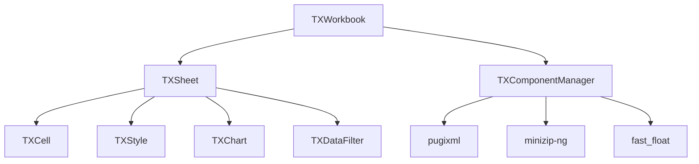

# TinaXlsx

**TinaXlsx** 是一个现代化的 C++17 Excel 文件处理库，专为高性能 XLSX 文件读写而设计。提供完整的样式系统、高级功能支持和优雅的 API 设计。

[](https://github.com/your-repo/TinaXlsx)
[](https://github.com/your-repo/TinaXlsx/releases)
[](https://en.cppreference.com/w/cpp/17)
[](LICENSE)
[](api-docs/html/index.html)

## ✨ 核心特性

### 🚀 **高性能设计**
- **零拷贝字符串处理** - 高效的内存管理
- **批量操作优化** - 大数据量处理优化
- **智能缓存机制** - 计算结果缓存
- **并发安全设计** - 多线程环境支持

### 🎨 **完整样式系统**
- **字体样式** - 字体、大小、颜色、效果
- **单元格对齐** - 水平/垂直对齐、文本旋转
- **边框样式** - 多种边框类型和颜色
- **填充样式** - 纯色、图案、渐变填充

### 🔧 **高级功能**
- **合并单元格** - 区域合并和管理
- **工作表保护** - 密码保护和权限控制
- **数字格式化** - 预定义和自定义格式
- **公式支持** - 基本公式解析和验证

### 💡 **现代化API**
- **类型安全** - 编译时类型检查
- **链式调用** - 流畅的API设计
- **异常安全** - 完整的错误处理
- **RAII机制** - 自动资源管理

## 🚀 快速开始

### 📦 安装依赖

```bash
# 克隆项目（包含所有子模块）
git clone --recursive https://github.com/your-repo/TinaXlsx.git
cd TinaXlsx

# 或者单独初始化子模块
git submodule update --init --recursive
```

### 🔨 构建项目

```bash
# 配置并构建
cmake -B cmake-build-debug -S . -DBUILD_TESTS=ON
cmake --build cmake-build-debug

# 运行测试
cmake --build cmake-build-debug --target run_all_tests
```

### 💻 基本使用

```cpp
#include "TinaXlsx/TXWorkbook.hpp"
using namespace TinaXlsx;

int main() {
    // 创建工作簿
    TXWorkbook workbook;
    auto sheet = workbook.createSheet("数据表");

    // 写入数据
    sheet->setCellValue("A1", "姓名");
    sheet->setCellValue("B1", "年龄");
    sheet->setCellValue("A2", "张三");
    sheet->setCellValue("B2", 25);

    // 设置样式
    auto headerStyle = workbook.createStyle();
    headerStyle->getFont()->setBold(true);
    headerStyle->getFont()->setColor(TXColor::BLUE);
    sheet->setCellStyle("A1:B1", headerStyle);

    // 保存文件
    workbook.save("example.xlsx");
    return 0;
}
```

## 🏗️ 架构设计

### 核心组件

| 组件 | 功能 | 特性 |
|------|------|------|
| **TXWorkbook** | 工作簿管理 | 多工作表、属性管理、文件I/O |
| **TXSheet** | 工作表操作 | 单元格管理、样式应用、保护机制 |
| **TXCell** | 单元格处理 | 多类型数据、格式化、公式支持 |
| **TXStyle** | 样式系统 | 字体、边框、填充、对齐 |
| **TXChart** | 图表功能 | 多种图表类型、数据系列 |
| **TXDataFilter** | 数据筛选 | 自动筛选、高级筛选 |

### 依赖关系



## 📋 环境要求

### 编译环境

| 要求 | 最低版本 | 推荐版本 |
|------|----------|----------|
| **C++编译器** | C++17 | C++20 |
| **CMake** | 3.16 | 3.20+ |
| **操作系统** | Windows 10, Linux, macOS | 最新版本 |

### 支持的编译器

| 编译器 | 最低版本 | 测试版本 |
|--------|----------|----------|
| **MSVC** | 2019 (19.20) | 2022 |
| **GCC** | 8.0 | 11.0+ |
| **Clang** | 7.0 | 14.0+ |

### 依赖库（自动管理）

| 库名称 | 版本 | 用途 | 许可证 |
|--------|------|------|--------|
| **pugixml** | 1.13+ | XML解析 | MIT |
| **minizip-ng** | 4.0+ | ZIP压缩 | Zlib |
| **zlib-ng** | 2.1+ | 压缩算法 | Zlib |
| **fast_float** | 6.0+ | 数值解析 | Apache 2.0 |
| **googletest** | 1.12+ | 单元测试 | BSD-3 |
| **doxygen** | 1.9+ | 文档生成 | GPL |

> 💡 **注意**：所有依赖库都通过git子模块自动管理，无需手动安装。

## 🔨 详细构建指南

### Windows (Visual Studio)

```bash
# 使用Visual Studio 2019/2022
cmake -B build -S . -G "Visual Studio 16 2019" -DBUILD_TESTS=ON
cmake --build build --config Release

# 或使用Ninja（推荐）
cmake -B build -S . -G "Ninja" -DCMAKE_BUILD_TYPE=Release -DBUILD_TESTS=ON
cmake --build build
```

### Linux/macOS

```bash
# Release构建
cmake -B build -S . -DCMAKE_BUILD_TYPE=Release -DBUILD_TESTS=ON
cmake --build build -j$(nproc)

# Debug构建
cmake -B build-debug -S . -DCMAKE_BUILD_TYPE=Debug -DBUILD_TESTS=ON
cmake --build build-debug
```

### 构建选项

| 选项 | 默认值 | 说明 |
|------|--------|------|
| `BUILD_TESTS` | ON | 构建单元测试 |
| `BUILD_DOCS` | OFF | 生成API文档 |
| `CMAKE_BUILD_TYPE` | Debug | 构建类型 |

### 运行测试

```bash
# 运行所有测试
cmake --build build --target run_all_tests

# 运行特定测试
build/tests/unit/BasicTests
build/tests/unit/DataFilterTests
build/tests/unit/ChartTests

# 使用CTest
cd build && ctest --output-on-failure
```

### 生成文档

```bash
# 启用文档生成
cmake -B build -S . -DBUILD_DOCS=ON

# 生成API文档
cmake --build build --target docs

# 查看文档
open api-docs/html/index.html  # macOS
start api-docs/html/index.html # Windows
xdg-open api-docs/html/index.html # Linux
```

## 📚 使用示例

### 基础操作

#### 创建和保存工作簿

```cpp
#include "TinaXlsx/TXWorkbook.hpp"

// 创建新工作簿
TXWorkbook workbook;
auto sheet = workbook.createSheet("销售数据");

// 设置表头
sheet->setCellValue("A1", "产品名称");
sheet->setCellValue("B1", "销售额");
sheet->setCellValue("C1", "增长率");

// 添加数据
sheet->setCellValue("A2", "产品A");
sheet->setCellValue("B2", 15000.50);
sheet->setCellValue("C2", 0.125); // 12.5%

// 保存文件
workbook.save("sales_report.xlsx");
```

#### 样式设置

```cpp
// 创建标题样式
auto titleStyle = workbook.createStyle();
titleStyle->getFont()
    ->setName("Arial")
    ->setSize(14)
    ->setBold(true)
    ->setColor(TXColor::WHITE);
titleStyle->getFill()
    ->setPattern(FillPattern::Solid)
    ->setForegroundColor(TXColor::BLUE);
titleStyle->getAlignment()
    ->setHorizontal(HorizontalAlignment::Center);

// 应用样式到范围
sheet->setCellStyle("A1:C1", titleStyle);

// 设置数字格式
sheet->setCellNumberFormat("B2", NumberFormat::Currency, 2);
sheet->setCellNumberFormat("C2", NumberFormat::Percentage, 1);
```

### 高级功能

#### 数据筛选

```cpp
// 设置自动筛选
sheet->setAutoFilter("A1:C10");

// 添加筛选条件
sheet->addFilterCondition("B", FilterOperator::GreaterThan, 10000);
sheet->addFilterCondition("C", FilterOperator::Between, 0.1, 0.3);
```

#### 图表创建

```cpp
// 创建柱状图
auto chart = sheet->createChart(ChartType::Column);
chart->setTitle("销售数据分析");
chart->setDataRange("A1:C10");
chart->setPosition("E2", "K15");

// 设置图表样式
chart->getTitle()->getFont()->setSize(16);
chart->getLegend()->setPosition(LegendPosition::Bottom);
```

#### 工作表保护

```cpp
// 设置保护选项
SheetProtection protection;
protection.allowSelectLockedCells = true;
protection.allowSelectUnlockedCells = true;
protection.allowFormatCells = false;

// 保护工作表
sheet->protect("password123", protection);

// 设置特定单元格为可编辑
sheet->setCellLocked("B2:C10", false);
```

## 📖 文档结构

```
TinaXlsx/
├── README.md           # 主文档（本文件）
├── docs/               # 项目管理文档
│   ├── KNOWN_ISSUES.md      # 已知问题跟踪
│   ├── ISSUE_CHECKLIST.md   # 问题检查清单
│   └── README.md            # 文档使用指南
├── api-docs/           # API文档（自动生成）
│   ├── html/           # HTML格式API文档
│   ├── xml/            # XML格式API文档
│   └── README.md       # API文档说明
├── include/TinaXlsx/   # 头文件
├── src/                # 源文件
├── tests/unit/         # 单元测试
└── third_party/        # 第三方库（子模块）
```

## 🔧 开发指南

### 代码规范

- **现代C++**：严格使用C++17标准特性
- **智能指针**：使用`std::unique_ptr`和`std::shared_ptr`
- **RAII机制**：资源获取即初始化
- **异常安全**：提供强异常安全保证
- **单元测试**：每个新类都必须有对应的测试

### 命名约定

- **类名**：`TX`前缀 + PascalCase（如`TXWorkbook`）
- **方法名**：camelCase（如`setCellValue`）
- **常量**：UPPER_SNAKE_CASE（如`MAX_ROWS`）
- **文件名**：与类名一致（如`TXWorkbook.hpp`）

### 贡献流程

1. **Fork项目** → 创建功能分支
2. **编写代码** → 遵循代码规范
3. **添加测试** → 确保测试覆盖
4. **更新文档** → 同步API文档
5. **提交PR** → 详细描述变更

## 🚀 性能特性

### 内存优化

- **零拷贝字符串** - 高效的字符串处理
- **对象池技术** - 减少内存分配开销
- **智能缓存** - 计算结果缓存机制
- **延迟加载** - 按需加载数据

### 处理能力

| 指标 | 性能 | 说明 |
|------|------|------|
| **最大行数** | 1,048,576 | Excel标准限制 |
| **最大列数** | 16,384 | Excel标准限制 |
| **文件大小** | >100MB | 大文件流式处理 |
| **处理速度** | >10K行/秒 | 批量操作优化 |

## 🤝 社区支持

### 获取帮助

- **📖 文档**：[API文档](api-docs/html/index.html)
- **🐛 问题**：[已知问题](docs/KNOWN_ISSUES.md)
- **💬 讨论**：GitHub Issues
- **📧 联系**：项目维护者

### 贡献代码

欢迎提交Pull Request！请确保：

- ✅ 代码通过所有测试
- ✅ 遵循项目代码规范
- ✅ 包含必要的文档更新
- ✅ 添加相应的单元测试

## 📄 许可证

本项目采用 [MIT 许可证](LICENSE)。

## 🙏 致谢

感谢以下开源项目的支持：

- [pugixml](https://github.com/zeux/pugixml) - XML解析库
- [minizip-ng](https://github.com/zlib-ng/minizip-ng) - ZIP压缩库
- [fast_float](https://github.com/fastfloat/fast_float) - 高性能数值解析
- [GoogleTest](https://github.com/google/googletest) - 测试框架
- [Doxygen](https://www.doxygen.nl/) - 文档生成工具

---

<div align="center">

**TinaXlsx** - 让Excel文件处理变得简单高效 🚀

*Copyright © 2025 wuxianggujun. All rights reserved.*

</div>
