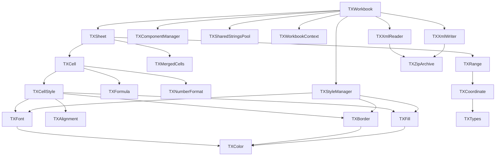
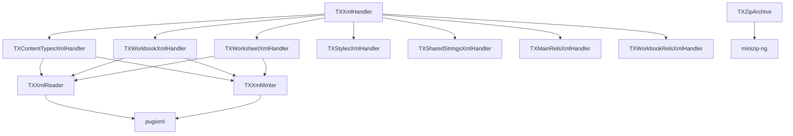

# TinaXlsx 类关系与功能详解

## 类继承与组合关系图

### 核心类关系图



### XML处理系统关系图



## 详细类功能说明

### 1. 核心业务类

#### TXWorkbook - 工作簿管理器

**职责**: 作为整个Excel文档的顶层容器，管理所有工作表和全局资源。

**核心成员变量**:
```cpp
private:
    std::vector<std::unique_ptr<TXSheet>> sheets_;           // 工作表集合
    std::size_t active_sheet_index_;                         // 当前活动工作表索引
    std::string last_error_;                                 // 最后错误信息
    ComponentManager component_manager_;                     // 组件管理器
    bool auto_component_detection_;                          // 自动组件检测标志
    TXStyleManager style_manager_;                           // 样式管理器
    TXSharedStringsPool shared_strings_pool_;               // 共享字符串池
    std::unique_ptr<TXWorkbookContext> context_;            // 工作簿上下文
```

**主要功能实现**:
1. **文件I/O操作**
   - `loadFromFile()`: 解析XLSX文件，依次读取各个XML组件
   - `saveToFile()`: 生成XLSX文件，协调各个组件的XML输出

2. **工作表管理**
   - `addSheet()`: 创建新工作表，自动注册到组件管理器
   - `removeSheet()`: 删除工作表，清理相关资源
   - `getSheet()`: 按名称或索引获取工作表

3. **资源协调**
   - 统一管理样式、共享字符串等全局资源
   - 协调各个组件的初始化和清理

#### TXSheet - 工作表处理器

**职责**: 管理单个工作表的所有数据和操作，包括单元格、行列、保护等。

**核心成员变量**:
```cpp
private:
    std::string name_;                                       // 工作表名称
    std::unordered_map<Coordinate, TXCell, CoordinateHash> cells_; // 单元格存储
    std::string lastError_;                                  // 错误信息
    TXMergedCells mergedCells_;                             // 合并单元格管理器
    TXWorkbook* workbook_;                                   // 父工作簿引用
    std::unordered_map<column_t::index_t, double> columnWidths_; // 列宽
    std::unordered_map<row_t::index_t, double> rowHeights_;     // 行高
    SheetProtection sheetProtection_;                        // 工作表保护
    FormulaCalculationOptions formulaOptions_;              // 公式计算选项
    std::unordered_map<std::string, Range> namedRanges_;    // 命名范围
```

**主要功能实现**:
1. **单元格操作**
   - 使用坐标哈希表高效存储稀疏单元格数据
   - 支持批量操作和范围操作
   - 自动类型检测和转换

2. **行列管理**
   - 动态行列插入和删除
   - 自动调整列宽和行高
   - 支持隐藏行列

3. **工作表保护**
   - 密码保护机制
   - 细粒度权限控制
   - 单元格锁定状态管理

#### TXCell - 单元格数据容器

**职责**: 存储和管理单个单元格的所有信息，包括值、类型、格式、样式等。

**核心成员变量**:
```cpp
private:
    CellValue value_;                                        // 单元格值(std::variant)
    CellType type_;                                          // 单元格类型
    std::unique_ptr<TXFormula> formula_object_;             // 公式对象
    std::unique_ptr<TXNumberFormat> number_format_object_;  // 数字格式对象
    bool is_merged_;                                         // 是否合并单元格
    bool is_master_cell_;                                    // 是否主单元格
    row_t::index_t master_row_idx_;                         // 主单元格行索引
    column_t::index_t master_col_idx_;                      // 主单元格列索引
    bool has_style_;                                         // 是否有样式
    u32 style_index_;                                        // 样式索引
    bool is_locked_;                                         // 是否锁定
```

**主要功能实现**:
1. **多类型值存储**
   - 使用std::variant支持字符串、数字、布尔值、日期等类型
   - 自动类型推导和转换
   - 类型安全的访问接口

2. **格式化支持**
   - 集成数字格式化对象
   - 支持自定义格式代码
   - 本地化格式支持

3. **公式处理**
   - 公式解析和验证
   - 依赖关系追踪
   - 计算结果缓存

### 2. 样式系统

#### TXStyleManager - 样式管理器

**职责**: 统一管理所有样式组件，实现样式的去重和复用，生成styles.xml。

**核心成员变量**:
```cpp
private:
    std::vector<std::shared_ptr<TXFont>> fonts_pool_;       // 字体池
    std::vector<std::shared_ptr<TXFill>> fills_pool_;       // 填充池
    std::vector<std::shared_ptr<TXBorder>> borders_pool_;   // 边框池
    std::vector<CellXF> cell_xfs_pool_;                     // 单元格样式池
    std::unordered_map<std::string, u32> font_lookup_;     // 字体查找表
    std::unordered_map<std::string, u32> fill_lookup_;     // 填充查找表
    std::unordered_map<std::string, u32> border_lookup_;   // 边框查找表
    std::unordered_map<std::string, u32> cell_xf_lookup_;  // 样式查找表
```

**主要功能实现**:
1. **组件去重**
   - 使用哈希表快速查找已存在的样式组件
   - 避免重复存储相同的样式
   - 返回统一的索引引用

2. **XML生成**
   - 生成完整的styles.xml结构
   - 正确的索引关系维护
   - 符合Excel标准的格式

#### TXCellStyle - 完整样式容器

**职责**: 封装单元格的完整样式信息，提供流畅的API接口。

**核心成员变量**:
```cpp
private:
    TXFont font_;                                           // 字体样式
    TXAlignment alignment_;                                 // 对齐方式
    TXBorder border_;                                       // 边框样式
    TXFill fill_;                                          // 填充样式
    NumberFormatDefinition numberFormatDefinition_;        // 数字格式定义
```

**主要功能实现**:
1. **链式调用API**
   - 所有设置方法返回自身引用
   - 支持连续的方法调用
   - 提高代码可读性

2. **样式组合**
   - 将多个样式组件组合成完整样式
   - 处理样式之间的依赖关系
   - 生成唯一标识键

#### TXFont - 字体样式

**职责**: 管理字体的所有属性，包括验证和错误处理。

**核心功能**:
1. **字体属性管理**
   - 字体名称、大小、颜色
   - 粗体、斜体、下划线、删除线
   - 字符集和字体族

2. **验证机制**
   - 字体名称有效性检查
   - 字体大小范围验证
   - 错误信息详细报告

#### TXColor - 颜色处理

**职责**: 统一的颜色管理，支持多种颜色格式和转换。

**核心功能**:
1. **多格式支持**
   - RGB/ARGB颜色值
   - 16进制字符串
   - HSL颜色空间

2. **颜色转换**
   - 格式之间的相互转换
   - 颜色空间转换
   - 预定义颜色常量

### 3. XML处理系统

#### TXXmlReader - XML读取器

**职责**: 专门用于读取XLSX文件中的XML内容，封装ZIP读取操作。

**核心功能**:
1. **ZIP集成**
   - 直接从ZIP文件读取XML
   - 自动处理编码问题
   - 错误恢复机制

2. **XPath查询**
   - 高效的节点查找
   - 批量数据提取
   - 复杂查询支持

#### TXXmlWriter - XML写入器

**职责**: 专门用于生成XLSX文件中的XML内容，封装ZIP写入操作。

**核心功能**:
1. **文档构建**
   - 结构化的XML构建
   - 自动格式化输出
   - 编码处理

2. **ZIP集成**
   - 直接写入ZIP文件
   - 压缩优化
   - 批量写入支持

#### 各种XmlHandler

**职责**: 处理XLSX文件中特定XML文件的读写逻辑。

**主要Handler**:
1. **TXContentTypesXmlHandler**
   - 处理[Content_Types].xml
   - 管理文件类型定义
   - 自动组件检测

2. **TXWorkbookXmlHandler**
   - 处理xl/workbook.xml
   - 工作表信息管理
   - 关系维护

3. **TXWorksheetXmlHandler**
   - 处理xl/worksheets/sheetN.xml
   - 单元格数据序列化
   - 行列信息处理

4. **TXStylesXmlHandler**
   - 处理xl/styles.xml
   - 样式信息序列化
   - 索引关系维护

### 4. 支持系统

#### TXComponentManager - 组件管理器

**职责**: 管理XLSX文件中的各种组件，支持自动检测和注册。

**核心功能**:
1. **组件注册**
   - 基础组件自动注册
   - 按需组件检测
   - 依赖关系管理

2. **Content Types生成**
   - 根据注册组件生成内容类型
   - 扩展名映射
   - 关系文件生成

#### TXZipArchive - ZIP处理

**职责**: 封装ZIP文件的读写操作，提供统一的文件访问接口。

**核心功能**:
1. **文件操作**
   - ZIP文件创建和读取
   - 文件添加和提取
   - 目录结构维护

2. **性能优化**
   - 压缩级别控制
   - 批量操作支持
   - 内存映射优化

#### TXSharedStringsPool - 共享字符串池

**职责**: 管理XLSX文件中的共享字符串，优化存储空间。

**核心功能**:
1. **字符串去重**
   - 自动检测重复字符串
   - 统一索引分配
   - 引用计数管理

2. **XML序列化**
   - 生成sharedStrings.xml
   - 正确的索引关系
   - 特殊字符处理

#### TXResult - 错误处理

**职责**: 提供统一的错误处理机制，类似Rust的Result类型。

**核心功能**:
1. **状态封装**
   - 成功/失败状态
   - 错误码和消息
   - 类型安全的结果

2. **链式处理**
   - 错误传播机制
   - 组合操作支持
   - 异常安全保证

## 数据流向分析

### 读取流程

```
XLSX文件 → TXZipArchive → TXXmlReader → 各种XmlHandler → 
TXWorkbook → TXSheet → TXCell → 用户API
```

### 写入流程

```
用户API → TXCell → TXSheet → TXWorkbook → 各种XmlHandler → 
TXXmlWriter → TXZipArchive → XLSX文件
```

### 样式处理流程

```
TXCellStyle → TXStyleManager → 组件去重 → 索引分配 → 
TXStylesXmlHandler → styles.xml
```

这个详细的类关系文档展示了TinaXlsx项目中各个类的职责、关系和实现细节，有助于理解整个系统的架构设计。
