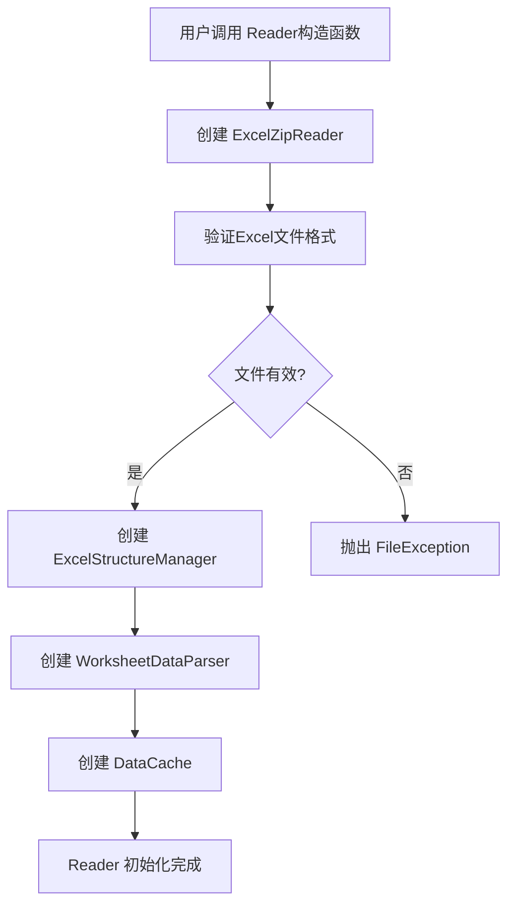
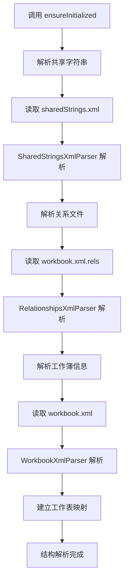
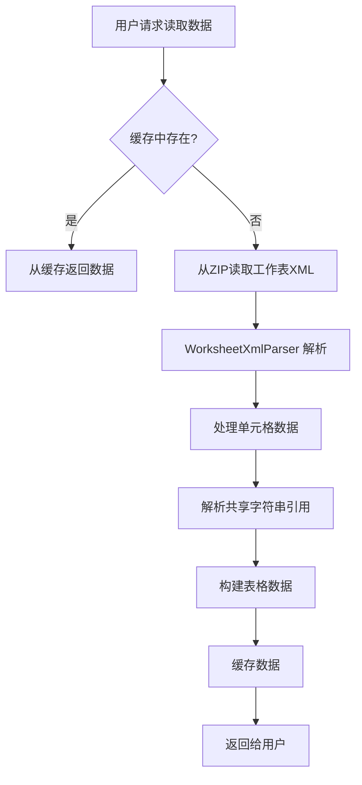
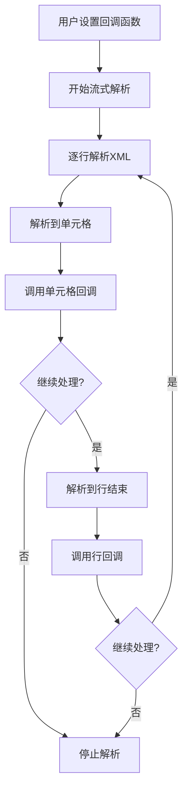

# TinaXlsx 项目架构与解析流程文档

## 📋 项目概述

TinaXlsx 是一个高性能的 Excel 读写库，采用组件化设计，实现了职责分离的架构。本文档详细说明了重构后的架构设计和数据解析流程。

## 🏗️ 架构设计

### 核心设计原则

1. **职责分离**：每个组件只负责一个明确的功能
2. **可测试性**：组件独立，便于单元测试
3. **可扩展性**：新的解析器或读取器易于添加
4. **内存效率**：智能缓存和流式处理
5. **错误处理**：完善的异常体系

### 组件架构图

```
┌─────────────────────────────────────────────────────────────┐
│                        TinaXlsx                            │
│                     (主要接口层)                            │
└─────────────────────────────────────────────────────────────┘
                                │
                                ▼
┌─────────────────────────────────────────────────────────────┐
│                        Reader                               │
│                   (读取接口管理器)                          │
│  • 提供统一的读取接口                                       │
│  • 管理当前读取状态                                         │
│  • 协调各组件工作                                           │
└─────────────────────────────────────────────────────────────┘
                                │
                ┌───────────────┼───────────────┐
                ▼               ▼               ▼
┌─────────────────────┐ ┌─────────────────┐ ┌─────────────────┐
│ ExcelStructureManager│ │WorksheetDataParser│ │   DataCache     │
│   (结构管理器)       │ │   (数据解析器)   │ │   (缓存管理器)   │
│ • 解析Excel文件结构  │ │ • 解析工作表数据  │ │ • LRU缓存策略   │
│ • 管理工作表信息     │ │ • 支持流式处理   │ │ • 维度信息缓存   │
│ • 管理共享字符串     │ │ • 回调函数支持   │ │ • 自动清理机制   │
│ • 管理文件关系       │ │ • 范围读取支持   │ │                 │
└─────────────────────┘ └─────────────────┘ └─────────────────┘
            │                       │
            ▼                       ▼
┌─────────────────────┐ ┌─────────────────────────────────────┐
│    ZipReader        │ │           XmlParser                 │
│   (ZIP文件操作)     │ │         (XML解析组件)               │
│ • ExcelZipReader    │ │ • WorkbookXmlParser                 │
│ • 文件验证          │ │ • SharedStringsXmlParser            │
│ • 条目查找          │ │ • RelationshipsXmlParser            │
│ • 内容读取          │ │ • WorksheetXmlParser                │
└─────────────────────┘ └─────────────────────────────────────┘
```

## 🔄 数据解析流程

### 1. 文件打开流程



### 2. Excel结构解析流程



### 3. 工作表数据读取流程



### 4. 流式读取流程



## 📦 组件详细说明

### Reader (读取接口管理器)

**职责**：
- 提供统一的Excel读取接口
- 管理当前读取状态和配置
- 协调各个组件的工作

**主要方法**：
- `openWorksheet()` - 打开工作表
- `readCell()` - 读取单元格
- `readRow()` - 读取行数据
- `readRange()` - 读取范围数据
- `readAllData()` - 读取全部数据
- `readWithCallback()` - 流式读取

### ExcelStructureManager (Excel结构管理器)

**职责**：
- 解析和管理Excel文件的整体结构
- 管理工作表信息、共享字符串、文件关系
- 提供延迟初始化机制

**核心功能**：
- 工作表信息管理
- 共享字符串解析和存储
- 文件关系映射
- 结构验证

### WorksheetDataParser (工作表数据解析器)

**职责**：
- 专门负责工作表数据的解析
- 支持流式解析和批量解析
- 提供回调函数支持

**解析能力**：
- 单元格数据解析
- 行数据解析
- 范围数据解析
- 流式处理支持

### DataCache (数据缓存管理器)

**职责**：
- 实现LRU缓存策略
- 缓存表格数据和维度信息
- 自动内存管理

**缓存策略**：
- 最近最少使用(LRU)算法
- 可配置的缓存大小
- 自动清理机制

### ZipReader (ZIP文件操作组件)

**职责**：
- 封装ZIP文件操作
- 提供Excel特定的文件访问方法
- 文件验证和错误处理

**功能特性**：
- 文件格式验证
- 条目查找和列表
- 内容读取和缓存

### XmlParser (XML解析组件)

**职责**：
- 封装expat库的使用
- 提供专门的Excel XML解析器
- 支持流式XML处理

**解析器类型**：
- `WorkbookXmlParser` - 工作簿解析
- `SharedStringsXmlParser` - 共享字符串解析
- `RelationshipsXmlParser` - 关系文件解析
- `WorksheetXmlParser` - 工作表解析

## 🚀 性能优化特性

### 1. 延迟初始化
- Excel结构只在需要时解析
- 减少启动时间和内存占用

### 2. 智能缓存
- LRU缓存策略
- 自动内存管理
- 维度信息缓存

### 3. 流式处理
- 支持大文件处理
- 回调函数机制
- 内存使用可控

### 4. 组件化设计
- 独立的组件便于优化
- 可插拔的解析器
- 模块化测试

## 🔧 使用示例

### 基本读取
```cpp
#include "TinaXlsx/TinaXlsx.hpp"

// 打开Excel文件
TinaXlsx::Reader reader("example.xlsx");

// 打开工作表
reader.openWorksheet("Sheet1");

// 读取单元格
auto cellValue = reader.readCell({0, 0});

// 读取行数据
auto rowData = reader.readRow(0);

// 读取全部数据
auto allData = reader.readAllData();
```

### 流式读取
```cpp
// 设置回调函数
auto cellCallback = [](const CellPosition& pos, const CellValue& value) {
    std::cout << "Cell(" << pos.row << "," << pos.column << "): " 
              << Reader::cellValueToString(value) << std::endl;
    return true; // 继续处理
};

auto rowCallback = [](RowIndex row, const RowData& data) {
    std::cout << "Row " << row << " processed with " 
              << data.size() << " cells" << std::endl;
    return true; // 继续处理
};

// 开始流式读取
reader.readWithCallback(cellCallback, rowCallback);
```

## 🧪 测试架构

### 测试分类
1. **单元测试** - 各组件独立测试
2. **集成测试** - 组件协作测试
3. **功能测试** - 完整功能验证
4. **性能测试** - 大文件和内存测试

### 测试覆盖
- 所有公共接口
- 错误处理路径
- 边界条件
- 性能基准

## 📈 扩展性设计

### 新增解析器
```cpp
class CustomXmlParser : public XmlParser {
    // 实现自定义XML解析逻辑
};
```

### 新增缓存策略
```cpp
class CustomCache : public DataCache {
    // 实现自定义缓存策略
};
```

### 新增文件格式支持
```cpp
class CustomZipReader : public ZipReader {
    // 实现新的文件格式支持
};
```

## 🎯 总结

重构后的TinaXlsx架构实现了：

1. **清晰的职责分离** - 每个组件专注于特定功能
2. **高度的可测试性** - 组件独立，便于测试
3. **良好的可扩展性** - 易于添加新功能
4. **优秀的性能** - 智能缓存和流式处理
5. **完善的错误处理** - 全面的异常体系

这种架构设计为TinaXlsx提供了坚实的基础，支持未来的功能扩展和性能优化。 