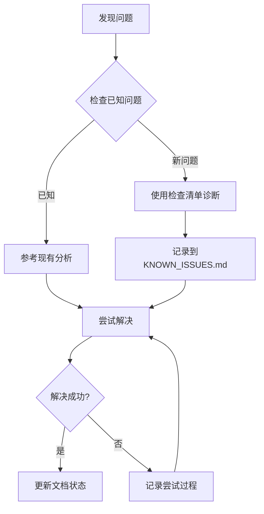

# TinaXlsx 项目管理文档

本目录包含 TinaXlsx 项目的开发管理文档，包括问题跟踪、开发指南等。

## 📁 文档目录结构

```
TinaXlsx/
├── README.md       # 主文档（完整的项目说明）
├── docs/           # 项目管理文档（本目录）
│   ├── KNOWN_ISSUES.md      # 已知问题跟踪
│   ├── ISSUE_CHECKLIST.md   # 问题检查清单
│   └── README.md            # 本文件
├── api-docs/       # API文档（自动生成）
│   ├── html/       # HTML格式API文档
│   ├── xml/        # XML格式API文档
│   └── README.md   # API文档说明
├── include/        # 头文件
├── src/            # 源文件
├── tests/unit/     # 单元测试
└── third_party/    # 第三方库（子模块）
```

## 📚 文档列表

### 🐛 问题跟踪文档

#### [`KNOWN_ISSUES.md`](./KNOWN_ISSUES.md)
**用途**：记录项目中已知但尚未解决的问题
**内容**：
- 问题分类和优先级
- 详细的问题描述和复现步骤
- 已尝试的解决方案
- 深度技术分析
- 问题统计和趋势

**适用人员**：
- 项目维护者
- 新加入的开发者
- 问题调试人员

#### [`ISSUE_CHECKLIST.md`](./ISSUE_CHECKLIST.md)
**用途**：快速问题检查和验证清单
**内容**：
- 问题验证步骤
- XML结构检查要点
- 常见修复方法
- 测试验证流程

**适用人员**：
- 日常开发调试
- 问题快速定位
- 代码审查

## 🎯 使用指南

### 发现新问题时

1. **首先查看** [`KNOWN_ISSUES.md`](./KNOWN_ISSUES.md) 确认问题是否已知
2. **使用** [`ISSUE_CHECKLIST.md`](./ISSUE_CHECKLIST.md) 进行快速诊断
3. **如果是新问题**，按照模板添加到 `KNOWN_ISSUES.md`

### 调试现有问题时

1. **参考** [`KNOWN_ISSUES.md`](./KNOWN_ISSUES.md) 中的技术分析
2. **按照** [`ISSUE_CHECKLIST.md`](./ISSUE_CHECKLIST.md) 的步骤进行验证
3. **记录** 新的发现和尝试的解决方案

### 解决问题后

1. **更新** [`KNOWN_ISSUES.md`](./KNOWN_ISSUES.md) 中的问题状态
2. **添加** 解决方案的详细说明
3. **更新** 问题统计信息

## 🔍 当前重点问题

### 🔴 Excel数值筛选问题

**问题**：生成的Excel文件中，数值列的筛选条件无法点击确定应用

**影响**：
- `DataFilterTest::AutoFilterBasicTest`
- `DataFilterTest::AutoFilterAdvancedTest`

**状态**：🔴 未解决

**下一步**：
1. 对比标准Excel生成的XML格式
2. 验证数值单元格类型属性
3. 测试不同的XML结构

**相关文档**：
- [`KNOWN_ISSUES.md#1-excel数值筛选无法点击确定应用筛选`](./KNOWN_ISSUES.md#1-excel数值筛选无法点击确定应用筛选)
- [`ISSUE_CHECKLIST.md#数值筛选问题检查清单`](./ISSUE_CHECKLIST.md#数值筛选问题检查清单)

## 📊 项目状态概览

### 问题统计

| 严重程度 | 数量 | 已解决 | 未解决 |
|---------|------|--------|--------|
| 🔴 严重  | 1    | 0      | 1      |
| 🟡 中等  | 2    | 2      | 0      |
| 🟢 轻微  | 1    | 0      | 1      |
| 🔵 功能缺失 | 3 | 0      | 3      |

### 最近解决的问题

- ✅ **UTF-8编码问题**：通过 `CompilerConfig.cmake` 解决
- ✅ **测试运行问题**：创建独立测试可执行文件

### 当前优先级

1. **最高**：Excel数值筛选问题
2. **高**：数据验证功能完善
3. **中**：条件格式功能验证
4. **低**：图表功能扩展

## 🛠️ 开发工作流程

### 问题报告流程



### 文档维护

- **每周**：检查问题状态，更新统计信息
- **每月**：整理已解决问题，归档历史记录
- **版本发布前**：全面审查所有已知问题

## 📞 联系方式

- **项目维护者**：wuxianggujun
- **问题讨论**：通过代码注释或文档更新
- **紧急问题**：直接修改相关文档并说明

## 📝 文档贡献

### 添加新问题

1. 在 [`KNOWN_ISSUES.md`](./KNOWN_ISSUES.md) 中按模板添加
2. 更新问题统计
3. 如需要，在 [`ISSUE_CHECKLIST.md`](./ISSUE_CHECKLIST.md) 中添加检查项

### 更新现有问题

1. 修改问题状态和描述
2. 添加新的解决尝试
3. 更新技术分析部分

### 文档格式

- 使用Markdown格式
- 保持一致的emoji使用
- 包含代码示例和XML片段
- 提供清晰的步骤说明

---

**文档版本**：v1.1
**最后更新**：2025年1月
**维护者**：TinaXlsx开发团队
